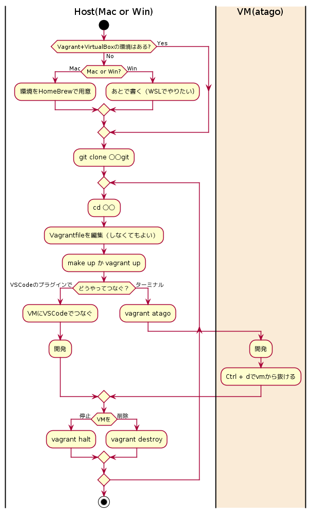

= Vagrantによる開発環境構築のテンプレート

== 環境構築から開発する流れ

== 【Mac】VagrantとVirtualBoxの環境をHomeBrewで用意

link:https://github.com/sunakan/sunady2020-homebrew-as-code[]を参考に、BrewfileにVirtualBoxとVagrantを導入する

.用意する流れ
----
$ Brewfileを編集
$ brew update
$ brew bundle
----

== git clone 〇〇.git

----
$ git clone https://github.com/sunakan/sunady2020-vagrant.git
----
